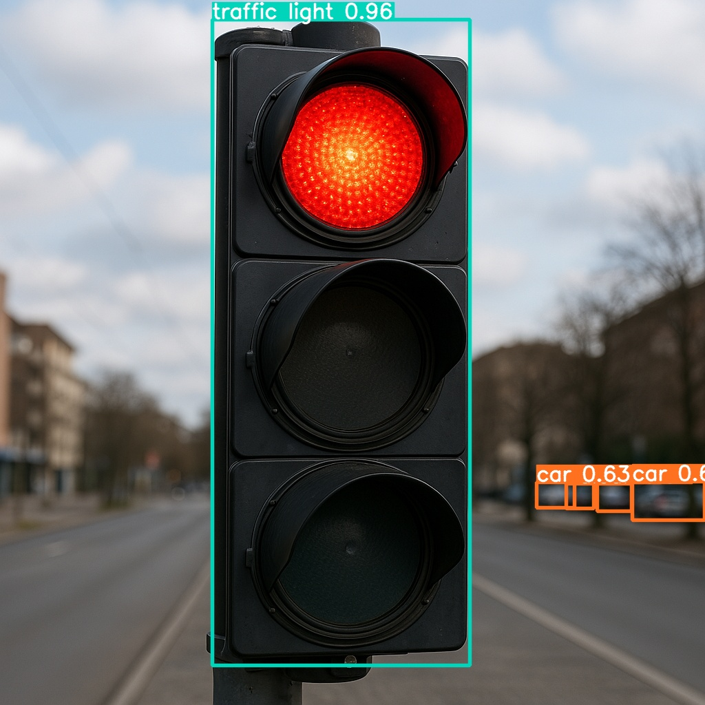

<!DOCTYPE html>
<html lang="en">
<head>
    <meta charset="UTF-8">
</head>
<body>

<h1>DailyVision 🚦🧠</h1>

<strong>Team QVision</strong> | Edge AI Hackathon Project

<h2>📚 Table of Contents</h2>
<ul>
    <li><a href="#1-overview">1. Overview</a></li>
    <li><a href="#2-features">2. Features</a></li>
    <li><a href="#3-folder-structure">3. Folder Structure</a></li>
    <li><a href="#4-running-the-application-with-installations">4. Running the Application with Installations</a></li>
    <li><a href="#5-sample-output">5. Sample Output</a></li>
    <li><a href="#6-team">6. Team</a></li>
    <li><a href="#7-acknowledgements">7. Acknowledgements</a></li>
</ul>

<h2 id="1-overview">1. Overview</h2>

    <strong>DailyVision</strong> is an Edge AI-powered assistive vision system designed to enhance situational awareness for individuals, especially those with visual impairments. While it excels at detecting traffic lights and signboards in real-time, its capabilities extend far beyond traffic navigation.

    DailyVision is built to support users in a wide range of daily activities by recognizing visual cues in their environment, extracting relevant text, and providing real-time voice feedback. Whether navigating busy streets, identifying building entrances, reading public notices, or interpreting directional signs in unfamiliar areas, DailyVision acts as a smart visual assistant.

    Optimized for low-power edge devices, the system integrates advanced technologies such as object detection, optical character recognition (OCR), and offline text-to-speech (TTS) to deliver fast, reliable, and private assistance—without relying on constant 

<h2 id="2-features">2. Features</h2>
<ul>
    <li>🔍 <strong>YOLOv8 Object Detection</strong> for identifying traffic lights and signboards</li>
    <li>🧾 <strong>EasyOCR</strong> for extracting text from detected regions</li>
    <li>🗣️ <strong>Text-to-Speech</strong> using <code>pyttsx3</code> for offline voice feedback</li>
    <li>🎨 <strong>Traffic Light Color Classification</strong> using HSV color masks</li>
    <li>🖼️ Annotated image output with bounding boxes and labels</li>
</ul>

<h2 id="3-folder-structure">3. Folder Structure</h2>
<pre><code>CV_VR/AI_PI/DailyVision/
├── vision_main.py
├── requirements.txt
├── images/
│   ├── traffic_red.jpg
│   └── signboard_1.jpg
├── src/
│   ├── audio.py
│   ├── detection.py
│   ├── ocr.py
│   └── utils.py
</code></pre>

<h2 id="4-running-the-application-with-installations">4. Running the Application with Installations</h2>

<h3>📦 4.1 Miniconda Installation</h3>

Miniconda is required to manage the application's Python environment and dependencies. Please follow the setup instructions carefully to ensure a consistent and reproducible environment.

For detailed steps, refer to the internal documentation: 
<a href="../../../Hardware/Tools.md">Set up Miniconda</a>

<h3>🔧 4.2 Git Configuration</h3>

Git is required for version control and collaboration. Proper configuration ensures seamless integration with repositories and development workflows.

For detailed steps, refer to the internal documentation: 
<a href="../../../Hardware/Tools.md">Setup Git</a>

<h3>🧪 4.3 Environment Setup</h3>

To set up the Python environment required for running the application, follow the steps below. This ensures all dependencies are installed in an isolated and reproducible environment.

<strong>Step 1:</strong> Create your working directory.

<pre><code>mkdir my_working_directory
cd my_working_directory</code></pre>

<strong>Step 2:</strong> Download your application using Git with sparse checkout to only fetch the necessary folder.

<pre><code>git clone -n --depth=1 --filter=tree:0 https://github.com/qualcomm/Startup-Demos.git
cd Startup-Demos
git sparse-checkout set --no-cone /CV_VR/AI_PI/DailyVision
git checkout
cd CV_VR/AI_PI/DailyVision</code></pre>

<strong>Step 3:</strong> Create a new Conda environment with Python 3.10.

<pre><code>conda create -n myenv python=3.10</code></pre>

<strong>Step 4:</strong> Activate the environment.

<pre><code>conda activate myenv</code></pre>

<strong>Step 5:</strong> Install the required dependencies from the <code>requirements.txt</code> file.

<pre><code>pip install -r requirements.txt</code></pre>

💡 Make sure you have Miniconda or Anaconda installed before running these commands.

<h3>🚀 4.4 Running the Application</h3>

<strong>Step 6:</strong> Run the application using the main script.

<pre><code>python vision_main.py</code></pre>

📠Make sure to place your test images in the <code>images/</code> folder and update the image path in <code>main.py</code> accordingly.

<h2 id="5-sample-output">5. Sample Output</h2>
<ul>
    <li>Annotated image saved as <code>annotated_output.jpg</code></li>
    <li>Sample annotated image: 
            
    </li>
    <li>Console output:
        <pre><code>Detected a traffic light: with color: red
Detected a person:</code></pre>
    </li>
    <li>Voice feedback via speakers</li>
</ul>

<h2 id="6-team">6. Team</h2>
<ul>
    <li>Vishnudatta Indraganti – Engineering Intern</li>
    <li>Guna Nekkanti – Engineering Intern</li>
    <li>Sneha Das – Engineering Intern</li>
    <li>Mythreya Garudadri – Engineering Intern</li>
</ul>

<h2 id="7-acknowledgements">7. Acknowledgements</h2>
<ul>
    <li>Qualcomm AI Hub EasyOCR</li>
    <li>Ultralytics YOLOv8</li>
</ul>

</body>
</html>
