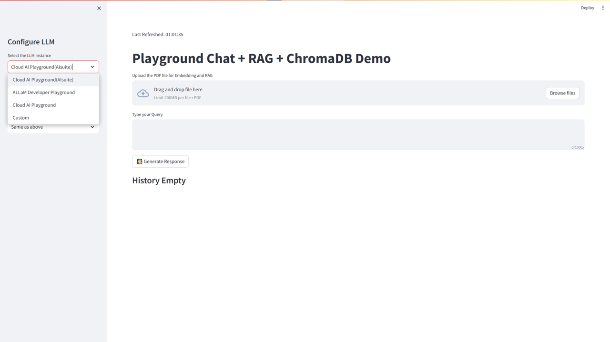
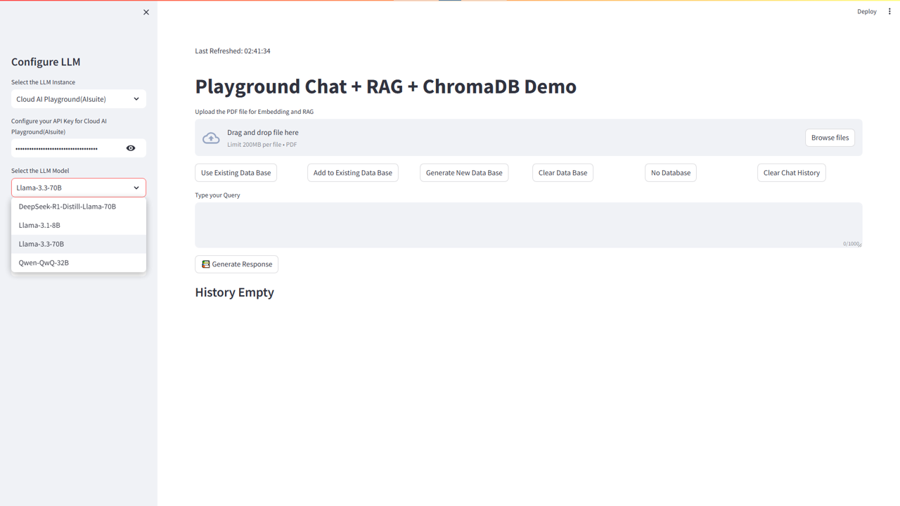
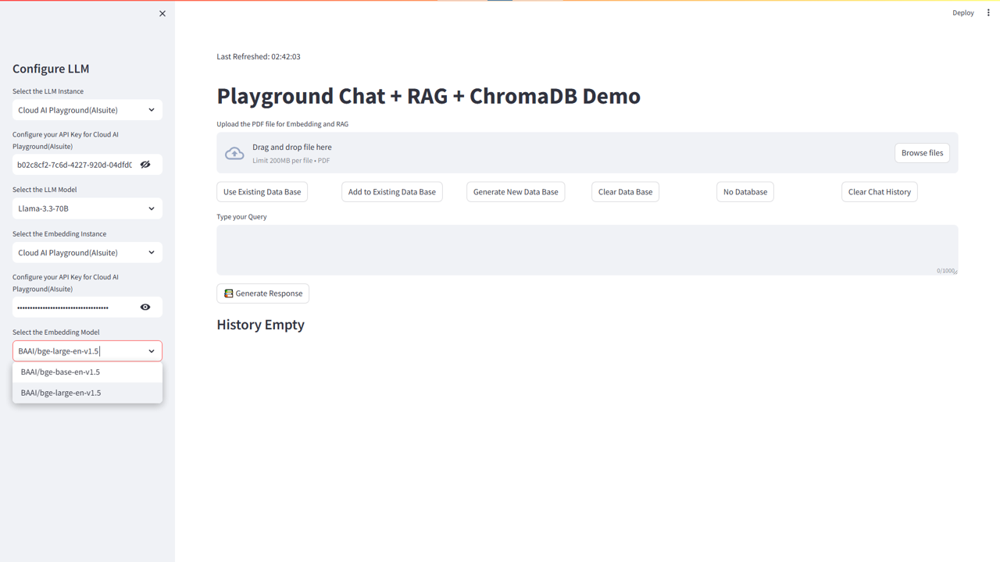

# Playground Chat + RAG + ChromaDB Demo Application

## Table of Contents
- [Overview](#1-overview)
- [Features](#2-features)
- [Setup Instructions](#%EF%B8%8F-3-setup-instructions)
  - [Miniconda Installation](#-31-miniconda-installation)
  - [Git Configuration](#-32-git-configuration)
- [Environment Setup](#-4-environment-setup)
- [Getting API Access](#-5-getting-api-access)
  - [Cloud AI Playground](#%EF%B8%8F-51-cloud-ai-playground)
  - [Allam Playground](#-52-allam-playground)
- [Set the API Key in Environment (Optional)](#%EF%B8%8F-6-set-the-api-key-in-environment-optional)
- [Run the Application](#-7-run-the-application)
  - [Application Demo](#-78-application-demo)


---

# 1. Overview

This demo application demonstrates how to integrate a Large Language Model (LLM) with Retrieval-Augmented Generation (RAG) using ChromaDB as the vector store. It enables users to query documents using natural language and receive contextually enriched responses.

---

# 2. Features

- Modular RAG pipeline with pluggable components.
- ChromaDB integration for fast and scalable vector search.
- Support for multiple LLM backends (e.g., Cloud AI Playground, Allam Playground, Custom).
- Choose between various models.

---

# 🛠️ 3. Setup Instructions

Before proceeding further, please ensure that **all the setup steps outlined below are completed in the specified order**. These instructions are essential for configuring the various tools required to successfully run the application.

Each section provides a reference to internal documentation for detailed guidance. Please follow them carefully to avoid any setup issues later in the process.

---

## 📦 3.1 Miniconda Installation

Miniconda is required to manage the application's Python environment and dependencies. Please follow the setup instructions carefully to ensure a consistent and reproducible environment.

For detailed steps, refer to the internal documentation:  
[Set up Miniconda]( ../../../Hardware/Tools.md#miniconda-setup)

## 🔧 3.2. Git Configuration

Git is required for version control and collaboration. Proper configuration ensures seamless integration with repositories and development workflows.

For detailed steps, refer to the internal documentation:  
[Setup Git]( ../../../Hardware/Tools.md#git-setup)

---
# 🧪 4. Environment Setup

To set up the Python environment required for running the application, follow the steps below. This ensures all dependencies are installed in an isolated and reproducible environment.

## 🔧 Steps

1. **Create your working directory** :
   ```bash
   mkdir my_working_directory
   cd my_working_directory
   ```

1. **Download Your Application** :
   ```bash
   git clone -n --depth=1 --filter=tree:0 https://github.com/qualcomm/Startup-Demos.git
   cd Startup-Demos
   git sparse-checkout set --no-cone /GenAI/CloudAI-Playground/ChatBot_LLM_RAG
   git checkout
   ```
   
1. **Navigate to Application Directory** :
   ```bash
   cd ./GenAI/CloudAI-Playground/ChatBot_LLM_RAG
   ```

1. **Create a new Conda environment** with Python 3.12:
   ```bash
   conda create -n myenv python=3.12
   ```

1. **Activate the environment**:
   ```bash
   conda activate myenv
   ```

1. **Install the required dependencies**:
   ```bash
   pip install -r requirements.txt
   ```

> 💡 Make sure you have Miniconda or Anaconda installed before running these commands.

# 🔑 5. Getting API Access

To use the application features that rely on external AI services, you need to obtain API keys from the respective playgrounds. Follow the instructions below for each platform.

## ☁️ 5.1. Cloud AI Playground

To retrieve your API key for the Cloud AI Playground, refer to the documentation: 
[API Key for Cloud AI Playground](../../../Hardware/Cloud%20AI%20Playground.md#APIKey-for-CloudAI-Playground)

## 🧠 5.2. Allam Playground

To retrieve your API key for the Cloud AI Playground, refer to the documentation: 
[API Key for Allam Playground](../../../Hardware/Cloud%20AI%20Playground.md#APIKey-for-Allam-Playground)

> Once you have obtained the keys, make sure to securely store them in your environment configuration or secrets manager as per your project’s security guidelines.

# 🛡️ 6. Set the API Key in Environment (Optional)

To securely manage your API keys, it is recommended to store them as environment variables. This approach helps avoid hardcoding sensitive information in your codebase.

## 🔧 How to Set Environment Variables
For instructions on setting environment variables on your system, refer to the documentation:  
[Setup Environment Variables](../../../Hardware/Tools.md#setup-environment-variables)

> 💡 Once set, your application can access the API key using standard environment variable access methods in your programming language (e.g., `os.environ` in Python).

# 🚀 7. Run the Application

To launch the application, execute the following command from the application directory:

```bash
streamlit run .\src\ChatApp.py
```

This will start the interactive web interface where you can configure and use the application.

---

## 🧠 7.1. Select LLM Instance

Choose the Large Language Model (LLM) provider you want to use (e.g., CloudAI Playground, Allam Playground, etc.). This determines the backend service that will process your queries.



---

## 🔐 7.2. Configure API Key

Enter the API key associated with the selected LLM instance. This is required to authenticate and access the model's capabilities.


---

## 🧬 7.3. Select LLM Model

After selecting the provider, choose the specific model (e.g., `Llama-3.3-70B`, `Llama-3.1-8B`, etc.) that best suits your use case.



---

## 🧠 7.4. Select Embedding Instance and Configure API Key *(Optional)*

If your workflow involves document embeddings (e.g., for semantic search), select the embedding service provider and configure its API key.


---

## 🧬 7.5. Select Embedding Model

Choose the embedding model (e.g., `BAAI/bge-base-en-v1.5`) to convert your documents into vector representations.



---

## 📄 7.6. Upload Your PDF File

Upload one or more PDF documents that you want the application to process. These documents will be parsed and embedded for querying.


---

## 🗃️ 7.7. Choose Options for Use and Configure Database

Decide how you want to manage the document data in the vector database. The following options are available:

1. **Use Existing** – Query the existing database without modifying it.
1. **Add to Existing Database** – Append new documents to the current database.
1. **Generate New Database** – Clear existing data and create a new database from uploaded files.
1. **Clear Database** – Remove all data from the current database.
1. **No Database** – Skip database usage and query the LLM directly.
1. **Clear Chat History** – Reset the current chat session.


---
## ✅ 7.8. Application Demo
> ✅ Once all configurations are complete, you can begin interacting with the application through the chat interface.


